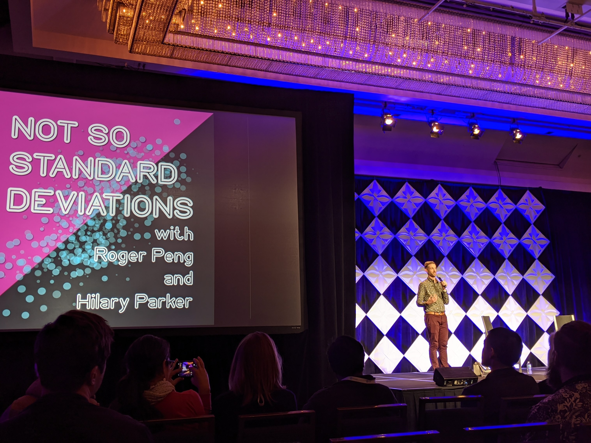
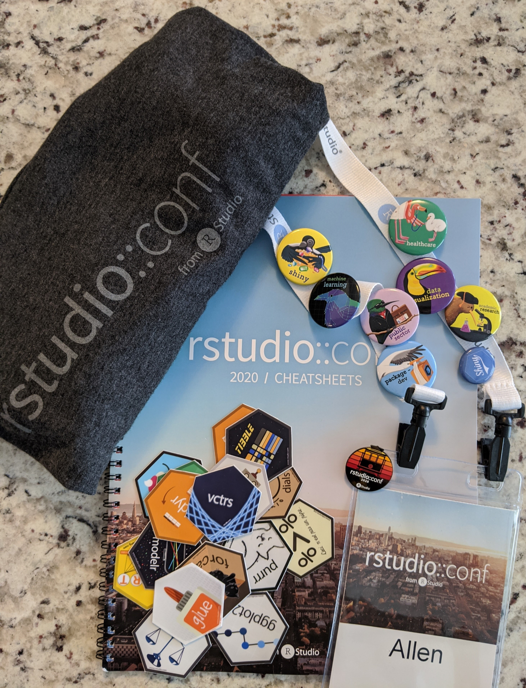
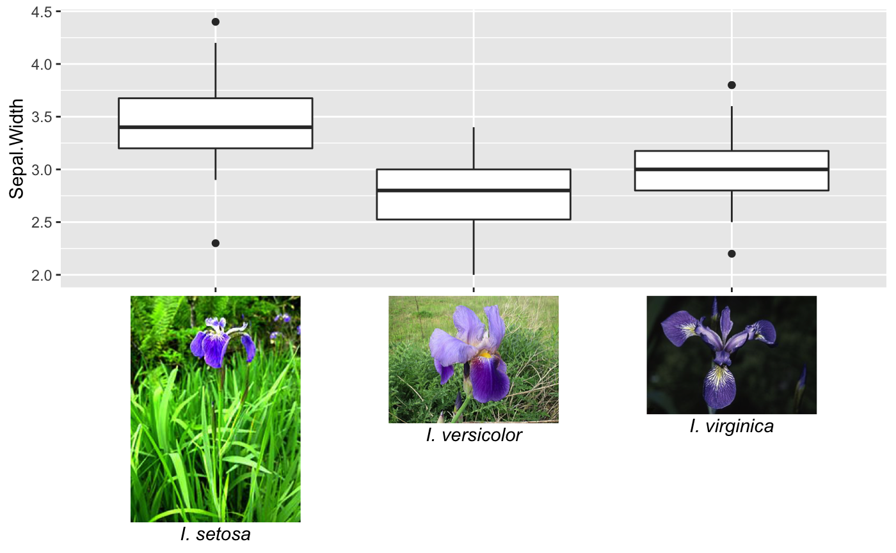

A couple weeks ago I attended the **rstudio::conf 2020** in San Francisco, participating in the training day workshops as well as the two day conference for the first time. To heap on all the praise at once... I really enjoyed the experience, there was a strong sense of community among attendees and I had great conversations with like-minded R users. It is nice to discuss nuanced data analysis details without fearing that person will yawn or furtively glance at a nearby timepiece in mid-conversation. On several occasions, a common collective struggle was found between members at the same table, leading to rather passionate and opinionated debates on *proprietary* software, aging data environments, and analytic methods. This was further emboldened during *birds of a feather* events, which assisted the gathering (flocking?) of those with similar interests. Colourful pins were even provided to easily spot those from your own flock. Except when someone adorned every pin, which I presume was to either present their interest in all topics or display their love of shiny pins and successful plunder of the pin cache. As an aside, the pins, along with entertaining and informative graphics in several presentations, are the work of [Allison Horst](https://blog.rstudio.com/2019/11/18/artist-in-residence/), the artist in residence for RStudio.

For those that did not attend, the full itinerary for the conference is currently posted [online](https://blog.rstudio.com/2019/11/25/thinking-about-rstudio-conf-2020-see-the-full-conference-schedule/). Briefly, the week started with various (18) 2-day workshops followed by an evening of poster presentations, with the 2-day conference starting the next morning. There were a four keynote speakers, (too) many breakout sessions, and an evening at the [California Academy of Science](https://www.calacademy.org/). The large variety of topics were aggregated into themes, such as 'programming', 'Shiny', 'Case Study', and 'Visualization'. Thankfully, rooms for each 15-20 minute breakout session were close enough together to easily transverse. 

With those comments out of the way, I will switch now to a more objective documentation of insights from attending the rstudio::conf. Although I did document some of my experience through photos, most of my efforts were by scribbling digital notes. I have broken these down into three sections (keynote speakers, breakout sessions, and training days) and will provide the key highlights from each. Most of the [slides](https://github.com/dfalbel/RStudioConf2020Slides) and [presentations](https://resources.rstudio.com/rstudio-conf-2020) have, or will, be provided online and I make specific reference to some throughout the remainder of this post. However, before we start, a picture of the goods plundered...

## Keynote presentations

1. **Open Source Software for Data Science** (J.J. Allaire, RStudio CEO): During the first keynote speech, J.J. Allaire talked about the direction of RStudio and their contributions to open source. His big announcement was RStudio becoming a *B-Certified corporation*, progressively buying out their shareholders, and rebranding to RStudio PBC from RStudio Inc. In essence, this means RStudio has a legal obligation to consider the impact of company decisions on employees, customers, and the wider community they provide services to. This ensures company direction is not solely governed by stakeholders and profit. For RStudio, as a company providing valuable open source tools, this was very welcome news and instilled a sense of confidence and trust in RStudio's future relationship with the wider R community. An entire [blog post](https://blog.rstudio.com/2020/01/29/rstudio-pbc) is dedicated to this announcement and you can read about RStudio's B-Certified score [here](https://bcorporation.net/directory/rstudio).

    At the end of his talk, J.J. Allaire took questions from the audience and provided a book recommendation: [Fooled by Randomness](https://en.wikipedia.org/wiki/Fooled_by_Randomness). From the synopsis online it sounds like an interesting read and part of an ongoing series.

1. **Data, visualization, and designing with AI** (Martin Wattenberg and Fernanda Viegas, Google): The main takeaway I had from this keynote were examples of the advanced data visualization tools that Google is creating. These have come from the [*People and AI Research* (PAIR) initiative](https://research.google/teams/brain/pair/), and provides better ways to interact with AI systems. This included visualization tools for model interpretation and to observe model bias/fairness. They even published a [guidebook](https://pair.withgoogle.com/) around these principles. Some of the tools they demoed were the [What if tool](https://pair-code.github.io/what-if-tool/) and [fairness simulation](https://research.google.com/bigpicture/attacking-discrimination-in-ml/).

1. **Object of type 'closure' is not subsettable** (Jenny Bryan, RStudio): This was my favorite keynote presentation, probably because it described the pain and suffering involved with debugging R code. Jenny explained the age-old mantra of 'turn it on and off again' before describing best practices of making reproducible examples for troubleshooting (i.e. improving posts on [stackoverflow](https://stackoverflow.com/)...). She also introduced `traceback()`, `rlang::last_trace()`, `options(error = recover)`, `browser()`, and `debug()`, many of which I have never used to their full potential. Her slides are [available](https://github.com/jennybc/debugging#readme) and I recommend watching the presentation when it is posted too!

1. **Not so standard deviations** (Hilary Parker and Roger Peng): The final keynote presentation was a live-recording of the podcast *Not so standard deviations*. After reviewing some common threads in their conversations over the past 100 episodes, Hilary and Roger discussed the importance of *design* and how it relates to modeling. The topic is a bit abstract and it is hard to pin down in just a few short sentences; Hilary and Roger appear to have discussed the topic at length across several recordings.

    In essence, they are searching for an answer to: 'You taught me all these models and methods but I still don't know what to do'.  
    I think many people experience this when they approach a modeling problem in the wild: confusion and occasional despair. However, I think this feeling is a good thing, if we become overly confident in a model too much faith may be placed in it. You can listen to this broadcast from the RStudio conference as well as others at their [website](http://www.nssdeviations.com/). 

## Breakout sessions

1. **Deploying end-to-end data science with shiny, plumber, and pins** (Alex Gold, RStudio): My main takeaway from this presentation, besides how to deploy an application, was the use of the `pins` package. This was my first time hearing about pins and they have a very valuable purpose. Where data typically sits on a comfy server, models and smaller objects created from data also need a place to live. The `pins` package provides a method of storing objects, essentially a caching mechanism, for small objects. For instance, when updating a model daily or weekly, `pins` provides a simple way to store and retrieve the model for use within the application. Definitely worth looking into! 

    Related links: [github](https://github.com/akgold/rsconf2020-deployment)

1. **Practical plumber patterns** (James Blair, RStudio): provided a compelling example of the progressive steps to deploy a data product at scale. He demonstrated how plumber code can be integrated directly within a package during deployment. As one tests their project's R code within a package another set of tests can also be performed for plumber. Examples of how to capture log information and test execution time while scaling the product were also provided.  

    Related links: [github](https://github.com/blairj09/ppp)

1. **Production grade shiny apps with golem** (Colin Fay, ThinkR): This talk gave a very interesting perspective on creating shiny applications. They provide a framework for making repetitive aspects of a shiny application into templates, which for large applications is easier to maintain. The structure is similar to an R package, which should be familiar to many already. 

    Related links: [github](https://github.com/ThinkR-open/golem), [book](https://thinkr-open.github.io/building-shiny-apps-workflow/), [slides](https://speakerdeck.com/colinfay/rstudio-conf-2020-production-grade-shiny-apps-with-golem)

1. **What's new in Tensorflow for R** (Daniel Falbel, RStudio) and **Deep Learning with R** (Paige Bailey, Google): Although I do not use the tools discussed in presentations on a routine basis, it was interesting to see the pace everything is changing. Most of the advancements have been for Tensorflow and Keras, and recent updates appear make the interface more appraochable and easier to work with. 

    Related links: [github](https://github.com/dfalbel/RStudioConf2020Slides)

1. **Approaches to Assay Processing Package Validation** (Ellis Hughes, Fred Hutch): Here I finally understood the difference between validation testing, verification, and unit testing. Validation ensures software is performing as expected as per a set of specifications, all of which can be done directly within an R package structure via `rmarkdown`,`testthat` and `roxygen2`.  

    Related links: [github](https://github.com/thebioengineer/validation)

1. **FlatironKitchen: How we overhauled a Frankensteinian SQL workflow with the tidyverse** (Nathaniel Phillips, Roche): This presentation provided a high-level overview of an internal package for creating patient cohorts for end-users such as epidemiologists. The process was extremely standardized yet flexible enough for many different kinds of analyses. However, there was an assumption that clean tables were available and could be linked reliably. I was curious to know how they would have accomplished that as well...

1. **3D ggplots with rayshader** (Tyler Morgan-Wall, Institute for Defense Analyses): I have never been a fan of 3D plotting but the beautiful demos in this presentation were compelling. `rayshader` provides an R alternative to software such as [Blender](https://www.blender.org/) to create 3D graphics. R coding provides a reproducible method instead of the typical graphical-user interfaces. What impressed me most were the stunning maps, which as suggested in the name, support ray-tracing! For someone who avoids 3D plots, I still believe it is only a matter of time before I make something with `rayshader` :open_mouth:.  

    Related links: [github](https://github.com/tylermorganwall/rayshader), [rayshader webpage](https://www.rayshader.com/), [rayrender webpage](http://www.rayrender.net/), [presentation](https://tylermw.com/presentations/rstudio2020/assets/player/KeynoteDHTMLPlayer.html#77)

    <figure>
      
      <figcaption>*Image created with `rayshader` by [Tyler Morgan-Wall](https://github.com/tylermorganwall/rayshader/blob/master/man/figures/smallhobart.gif).*</figcaption>
    </figure>  

1. **Tidyverse 2019-2020** (Hadley Wickham, Chief Scientist at RStudio): Hadley introduced some of the highlights over the past year, and shared some exiting new packages such as `vroom` for fast data importing and `vctrs` for working with vectors. He also discussed the pitfalls faced with *lazyeval* and *tidyeval* over the past few years and how they are making things better; they even are writing a book on *tidyeval* now.  

    Related links: [book](https://tidyeval.tidyverse.org/), [vroom](https://github.com/r-lib/vroom), [vctrs](https://github.com/r-lib/vctrs)

1. **Spruce up your ggplot2 visualization with formatted text** (Claus Wilke, University of Texas): I was really impressed with this presentation. Claus already has great contributions to `ggplot2` through packages such as `cowplot` and `ggridges`. His latest package `ggtext` now provides solutions to many common frustrations involving formatting text in ggplots. Finally, *italicizing* species names is easy!
 
    Related links: [slides](https://www.slideshare.net/ClausWilke/spruce-up-your-ggplot2-visualizations-with-formatted-text), [github](https://github.com/wilkelab/ggtext)
    
    <figure>
      
      <figcaption>*Using `ggtext` to insert images and formatted text, by [Claus Wilke](https://raw.githubusercontent.com/wilkelab/ggtext/master/man/figures/README-unnamed-chunk-5-1.png).*</figcaption>
    </figure>  

1. **Parallel Computing With R Using Foreach, Future, And Other Packages** (Bryan Lewis): My own projects have not typically needed the performance improvements of parallel processing. However, the unified framework within the `future` package has tempted me to reevaluate my work-flows. When I have looked at parallel processing options in R before, I was overwhelmed by the options, often dependent upon the operating system of choice. `future`, as stated on its CRAN web-page, provides "...distributed processing in R for everyone"! 

    Related links: [CRAN](https://cran.r-project.org/web/packages/future/index.html)

1. **How Rmarkdown changed my life** (Rob Hyndman, Monash University): I thought I used Rmarkdown for many things, but after seeing the slew of documents Dr. Hyndman has professionally templated and automated, I need to re-evaluate how to leverage Rmarkdown even more! 

    Related links: [website](https://robjhyndman.com/), [slides](https://robjhyndman.com/seminars/rmarkdown/)

## Workshop (training days)

Before the conference I attended the [**Applied Machine Learning workshop**](https://github.com/rstudio-conf-2020/applied-ml) hosted by [Max Kuhn](https://github.com/topepo) and [Davis Vaughan](https://github.com/DavisVaughan) where they introduced and provided examples for the suite of packages within `tidymodels`. Although they said this is not a replacement to `caret` it appears to provide much more flexibility and will receive more updates and features. Since the training materials for all the workshops are [online](https://github.com/rstudio-conf-2020), I will just provide a cursory overview.

As with most R users, I am familiar with learning new packages from documentation and scouring github pages. Learning the `tidymodels` package directly from the developers was a nice change. Where `tidyverse` provides tools for general data pipeline operations, `tidymodels` provides tools for modeling. This includes pre-processing steps, model tuning, and validation. As listed on their [github](https://github.com/tidymodels/tidymodels), `tidymodels` is comprised of many interconnected packages: 

- [dials](https://tidymodels.github.io/dials/)
- [parsnips](https://tidymodels.github.io/parsnip/)
- [recipes](https://tidymodels.github.io/recipes/)
- [rsample](https://tidymodels.github.io/rsample/)
- [tune](https://tidymodels.github.io/tune/)
- [workflows](https://tidymodels.github.io/workflows/)
- [yardstick](https://tidymodels.github.io/yardstick/)
- ... :dizzy_face:

Do not fear, although `tidymodels` is relatively new, they already have some decent [documentation](https://rviews.rstudio.com/2019/06/19/a-gentle-intro-to-tidymodels/) but, to be fair, piecing it all together alone would have taken some time. Being introduced to the package and going through examples with the creators was both the fastest way to learn and provided opportunities to ask them what new features we could expect (or brazenly ask for specific additions). Together with `tidyverse`, `tidymodels`, and the collection of reporting platforms like `rmarkdown` and `shiny`, RStudio has created an entire toolkit following a standard coding philosophy, which is refreshing as I have often found many R packages do not easily interoperate!

For those planning on registering for a workshop next year and are familiar with R, I recommend choosing a workshop that is labeled as *intermediate*. Even if you don't understand everything, it will have more value and push the limits of your knowledge! In addition to all the content I learned about `tidymodels`, this workshop introduced a few models I have never used before, such as *multivariate adaptive regression splines (MARS)*, provided in packages with clever names (e.g [`earth`](https://cran.r-project.org/web/packages/earth/index.html)).

## Final thoughts

Over the span of just a few years the RStudio conference has grown from several hundred to several thousand attendees. Next year it is expected to grow again and will be held in Orlando, Florida. You can already [register](https://rstudio.com/conference/) and receive early bird discounts. Attending the rstudio::conf is a great opportunity to connect with the community and learn the latest tools but if this is not possible, many of the presentations are live-streamed so you can still experience the conference as it happens. With so much content, it is hard to see everything during the conference. Thankfully, RStudio is good about posting content online after the conference concludes. You may miss some of the charm and interesting conversations if you cannot attend in-person but that doesn't mean you can't participate. Stay in the know and experience rstudio::conf whatever way you can, go check it [out](https://resources.rstudio.com/rstudio-conf-2020)!

