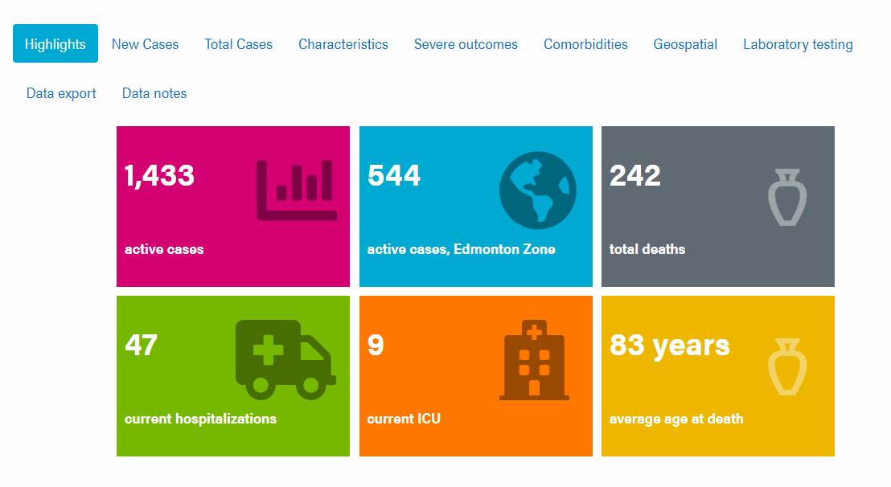

## R Markdown and customization

For better or worse, creating reports is a common (if not endless) request for anyone working with data. R Markdown makes the reporting process easier, which I am very thankful for and it has definitely [not gone unnoticed](https://rstudio.com/resources/rstudioconf-2020/how-rmarkdown-changed-my-life/) by others. If this is the first time hearing about R markdown, enlightenment awaits you [here](https://bookdown.org/yihui/rmarkdown/).

R Markdown can do many great things right out of the box, as is evident from the details in Yihui Xie's new book [R Markdown Cookbook](https://bookdown.org/yihui/rmarkdown-cookbook/). However, [Markdown](https://www.markdownguide.org/getting-started/), a markup language, is meant to be simple and has some [recognized limitations](https://yihui.org/en/2013/10/markdown-or-latex/). If one is *familiar* with web languages (HTML, CSS, JavaScript), this is usually not an issue and these can be sprinkled into the document to add any necessary customization; if one is *unfamiliar*, the process can be a journey which usually involves scouring Stack Overflow in hopes of discovering the ever elusive ready-made solution. 

## Customized info tiles in R Markdown
One example customization is creating interactive information tiles that act both as report highlights and navigation aides. Although `ggplot2` can get pretty close, the result is a static image, and using something like [Shiny](https://shiny.rstudio.com) may seem excessive or even unsuitable if the final HTML document needs to work offline for non-R users. This narrows our toolbox to languages that work directly in the browser. Several approaches could be used, such as leveraging frameworks like [CSS Grid](https://css-tricks.com/snippets/css/complete-guide-grid/) and [React](https://reactjs.org) but for our purpose there should be no reason why we cannot simply use a combination of basic HTML, CSS and JavaScript. Even a quick Google search will bring up an assortment of [starting examples](https://stackoverflow.com/questions/35656195/creating-tiles-with-divs) to get started.

Let's assume you want to create a large report with [tabbed sections](https://bookdown.org/yihui/rmarkdown/html-document.html#tabbed-sections). R Markdown leverages libraries such as Bootstrap to make some of these features possible. To further organize large reports, one option is to provide key highlights in a series of information tiles, which can also act as navigation buttons. For example, this is what was used for Alberta Health's daily reporting on COVID-19:



This feature can be created directly within the R Markdown document in just a few steps.

## Set up document

First we will create an R Markdown document using the `bookdown::html_document2` output. Other HTML outputs could work, but this version has some extra features available through [`bookdown`](https://bookdown.org/yihui/bookdown/a-single-document.html). Your `YAML` header may look something like the following:
````yaml
---
title: "Tile Info Test"
author: "Allen OBrien"
date: "6/11/2020"
output: 
  bookdown::html_document2:
    keep_md: TRUE
    self-contained: TRUE
---

`r ''````{r}
knitr::opts_chunk$set(echo = TRUE)
library(fontawesome)
```
````

`fontawesome` is an optional addition, in case you want to include graphics in the information tiles. Now, create a tabset report with a section for the highlights and as many others needed for your respective report. 


````r
# COVID-19 in Alberta  {- .tabset .tabset-fade .tabset-pills}

## Highlights {-}

## First Content Tab {-}

# {-}
````
At this point you may already have lost interest and wonder how much longer this torment will continue before you see the final product and code...

 

If you care not for the details, skip to the end to see the final [example template](#example-template).

## The backbone - HTML

The underlying structure for all the tiles is made with HTML, upon which formatting and interactivity will be added. Several sets of `<div> </div>` tags will be used, one for encompassing the entire set of tiles and another set for each individual tile. Since Markdown renders HTML you can place the code directly within the file under the 'Highlights' tab, no code chunk required.

````html
<div>
  <div style = "background: #d40072;">
   <span">1234</span> <br />
   <span>Details</span> 
  </div>
  
  <div style = "background: #00aad2;">
   <span>1234</span> <br />
   <span>Details</span> 
  </div>
</div>
````

Although it won't look like it yet, this code will create two 'tiles'. Within each nested `<div> </div>`, the `<span> </span>` tags contain information we want to highlight. Being within an R Markdown document it is easy to avoid hard-coding information by adding in-line R code `` `r knitr::inline_expr("{code}")` `` within the HTML tags. We can also set styling to the `background` through some in-line CSS.


If you want an icon included, try adding an additional `<span>` with the associated R code (i.e. using `fontawesome::fa()`) or Unicode (e.g. `knitr::asis_output('\U26b1')`:

````html
<div>
  <div style = "background: #d40072;">
   <span>1234</span> 
   <span>Details</span> 
   <span> `r knitr::inline_expr("fontawesome::fa('chart-bar', fill = '#000000', height = 'inherit')")` </span>
  </div>
</div>
````
However, at this point, the tiles will be both ugly and static. The next step will address the former concern.

## The styling - CSS
Although we could add all the syling within each `<div>` or `<span>`, this quickly becomes unwieldy. Instead, we can either **(a)** create a separate CSS file to organize the styling and load it from the `YAML` header or **(b)** include the necessary CSS as a code chunk within the R Markdown document, which is done here. To those unfamiliar with CSS, it may help to browse [w3schools](https://www.w3schools.com/css/). Formatting will be added through various 'classes' (denoted by the prefixed `.`) which will be assigned to their respective HTML tags. Let's create formatting for the basic information tile.

````css
`r '' ` ```{css, echo=FALSE}

.info-tile {
  height: 20vw;
  width: 30vw;
  max-width: 290px;
  max-height: 200px;
  background: #ef69b9;
  display: inline-block;
  text-overflow: ellipsis;
  overflow: hidden;
  word-wrap: break-word;
  line-height: 5vw;
  font-size: 5vw;
  color: white;
  font-weight: bold;
  position: relative;
  margin:0.5%
}

// Additional CSS...

```
````

This is a lot of detail and I encourage you to explore each element to see how it works. The most important piece to create the grid of tiles is `display: inline-block`. The remaining key-value pairs adjust the box size, font style, and how the text is arranged.  

We can also create a *highlight* effect by reducing the opacity when the mouse cursor hovers over the tile:

```{css, results = FALSE}
.info-tile:hover {
  opacity:0.5;
}
```

Different sizing can be assigned to the text, as well as the positioning of any included images/icons.

```{css, results = FALSE}
.info-tile-large-text {
  display: inline-block;
  padding-left: 1vw;
  margin-top: 2.5vw;
  margin-bottom:4vw;
}

.info-tile-small-text {
  display: inline-block;
  font-size: 40%;
  padding-left: 1vw;
}

.info-tile-img {
  position: absolute;
  left: 52%;
  top: 15%;
  opacity: .4;
  height: 10vw;
  font-size:10vw;
}
```

Finally, we want the tiles to scale to screen sizes on different devices (mobile, tablet, and desktop). `@media screen` can designate specific format changes when the screen size reaches a threshold. In the example below, the text and tile sizing will be adjusted when the screen width reaches 1,000 pixels.

```{css, results = FALSE}
/* At large media widths */
@media screen and (min-width: 1000px) {
  .info-tile {
    font-size: 50px;
    line-height: 65px;
  }
  
  .info-tile-large-text {
    display: inline-block;
    padding-left: 10px;
    margin-top: 25px;
    margin-bottom: 20px;
  }
  
  .info-tile-small-text {
    display: inline-block;
    font-size: 40%;
    padding-left: 10px;
  }
  
  .info-tile-img{
    position: absolute;
    left: 52%;
    top: 15%;
    //opacity: .4;
    height: 100px;
    font-size: 100px;
  }
}
```

The styles now need to be associated with the HTML structure, which is done by adding a `class` to the tags. We also assign each tile a unique `id`; this makes it easier to adjust specific tiles, both in terms of their style and functionality.

````html
<div>
  <div class="info-tile" id="tile1" style = "background: #d40072;">
   <span class = "info-tile-large-text">1234</span> <br />
   <span class = "info-tile-small-text">Details</span> 
  </div>
  
  <div class="info-tile" id="tile2" style = "background: #00aad2;">
   <span class = "info-tile-large-text">1234</span> <br />
   <span class = "info-tile-small-text">Details</span> 
  </div>
</div>
````

After adding a few more tiles, you will have something akin to the following...

  

Collectively, we now have tiles that are much easier on the eyes but they still require some interactivity!


## The functionality - JavaScript

The final component is to allow the information tiles to act as navigation buttons, taking users to the tab with additional details related to the tile. Like before, the associated JavaScript code can be either sourced as a separate file through the `YAML` header, or added as a specific chunk, as done here. The concept is simple, once the page is loaded each tile will have an `on-click` event function that will navigate the Document Object Model (DOM) and reveal the tab of interest. The tiles and tabs are tracked by a unique `id` (prefixed with `#`); we already assigned the tiles an `id` and the tabset headers in the R Markdown file should match the target destination (in this case, *First Content Tab* will have the *#first-content-tab* `id`). The popular [jQuery](https://jquery.com) library is used here but vanilla JavaScript can achieve the same effect. 


````js
`r '' ````{js, echo = FALSE}

// Set destination for clicks on the id tabs after page is ready
$(document).ready ( function () {

// When tile 1 (#tile1) is clicked, navigate to the report-details tab.
$( "#tile1" ).on( "click", function() {
$('.nav-pills li a[href="#first-content-tab"]').tab('show');
});

// Repeat for other tiles, or create a function/loop to reduce code

});
```
````

Now we should have something pretty close to the example seen from the Alberta Health COVID-19 public dashboard. This is just a starting point and I would expect additional tweaks would be required for any individual use-case. 

## Example template
I would be remiss if I didn't tie the code pieces together into a working example. Below you will find the final assembled code template.

````r
---
title: "Tile Info Test"
author: "Allen OBrien"
date: "6/11/2020"
output:
  html_document:
    df_print: paged
  bookdown::html_document2:
    keep_md: no
    self-contained: yes
---

`r '' ` ```{r setup, include=FALSE}
knitr::opts_chunk$set(echo = TRUE)
library(fontawesome)
```

`r '' ` ```{css, echo=FALSE}
.info-tile {
  height: 20vw;
  width: 30vw;
  max-width: 290px;
  max-height: 200px;
  background: #ef69b9;
  display: inline-block;
  text-overflow: ellipsis;
  overflow: hidden;
  word-wrap: break-word;
  line-height: 5vw;
  font-size: 5vw;
  color: white;
  font-weight: bold;
  position: relative;
  margin:0.5%
}

.info-tile:hover {
  opacity:0.5;
}

.info-tile-large-text {
  display: inline-block;
  padding-left: 1vw;
  margin-top: 2.5vw;
  margin-bottom:4vw;
}

.info-tile-small-text {
  display: inline-block;
  font-size: 40%;
  padding-left: 1vw;
}

.info-tile-img {
  position: absolute;
  left: 52%;
  top: 15%;
  opacity: .4;
  height: 10vw;
  font-size:10vw;
}

/* At large media widths */
@media screen and (min-width: 1000px) {
  .info-tile {
    font-size: 50px;
    line-height: 65px;
  }
  
  .info-tile-large-text {
    display: inline-block;
    padding-left: 10px;
    margin-top: 25px;
    margin-bottom: 20px;
  }
  
  .info-tile-small-text {
    display: inline-block;
    font-size: 40%;
    padding-left: 10px;
  }
  
  .info-tile-img{
    position: absolute;
    left: 52%;
    top: 15%;
    //opacity: .4;
    height: 100px;
    font-size: 100px;
  }
}
```

`r '' ````{js, echo = FALSE}

// Set destination for clicks on the id tabs after page is ready
$(document).ready ( function () {

// When tile 1 (#tile1) is clicked, navigate to the report-details tab.
$( "#tile1" ).on( "click", function() {
$('.nav-pills li a[href="#first-content-tab"]').tab('show');
});

// Repeat for other tiles, or create a function/loop to reduce code

});
```

# Report  {- .tabset .tabset-fade .tabset-pills}

## Highlights {-}

<div>
  <div class="info-tile" id="tile1" style = "background: #d40072;">
   <span class = "info-tile-large-text">1234</span> <br />
   <span class = "info-tile-small-text">Details</span> 
  </div>
  
  <div class="info-tile" id="tile2" style = "background: #00aad2;">
   <span class = "info-tile-large-text">1234</span> <br />
   <span class = "info-tile-small-text">Details</span> 
  </div>
</div>

## First Content Tab {-}

# {-}

````

