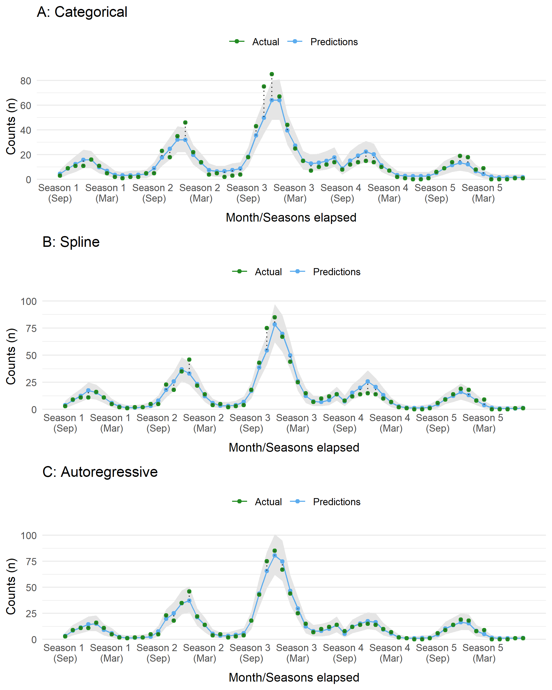

```{css, echo = FALSE, include = TRUE}
/* Allow long formulas to have a scroll bar added */
mjx-container {
  overflow-x: auto;
}
```

```{r chunk_options, include = FALSE}
knitr::opts_chunk$set(echo = TRUE, warning = FALSE, message = FALSE)
```

```{r dep_from_part1, include = FALSE}
# Variables for total time, and before and after intervention
n_years <- 5
N <- 12 * n_years
N_b4 <- N * (n_years- 2)/n_years
N_after <- N * (n_years- 3)/n_years  

ggplot_its_base <- function(data, n_years, x_label_step = 6) {
  ggplot(data, aes(x = months_elapsed)) +
    ylab('Counts (n)') +
    xlab('Month/Seasons elapsed') +
    scale_x_continuous(breaks = seq(1, n_years*12, by = x_label_step),
                       labels = function(x) {paste0('Season ', ceiling(x/12), ' \n(', data$months[x],')')}) + # Start at Sept
    theme_minimal() + 
    theme(legend.position = 'top', 
          legend.title = element_blank(), 
          panel.grid.major.x = element_blank(),
          panel.grid.minor.x = element_blank(),
          axis.text.x = element_text(vjust = 5))
  
}

ggplot_its_pred <- function(plot) {
  list(
  geom_ribbon(aes(ymin = `Q5`, ymax = `Q95`), fill = 'grey90'),
  geom_point(aes(y = Estimate, color = 'Predictions')),
  geom_line(aes(y = Estimate, color = 'Predictions')),
  geom_point(aes(y = cases, color = 'Actual')),
  geom_segment(aes(xend = months_elapsed, y = cases, yend  = Estimate), linetype = 'dotted', color = 'grey20'),
  scale_color_manual(values = c('Predictions' = 'steelblue2', 'Actual' = 'forestgreen'))
  )
}

```

> This post is the second of two parts. The focus here is on Bayesian interrupted time series modelling using data simulated in [part 1](/post/bayes-interrupted-ts-part1/) to depict a public health surveillance and intervention program.

## Recap

In this post we continue our journey using Bayesian Interrupted Time Series (ITS) analysis to understand the impact of *Drug X* on a novel infection. Previously, we prepared a simulated dataset depicting a disease intervention scenario. By creating the dataset, we know the generative process which makes it easier to understand how well various models will fit to the data sample. If you missed the first post and are interested in how the data for this part was simulated, you can jump there [now](post/bayes-interrupted-ts-part1/). If not, let us proceed with Bayesian modelling! As before, we will first set our seed variable and load some necessary libraries. 

```{r}
# Assign seed for R and to later BRM fits
seed_value <- 145
set.seed(seed_value)

# Libraries
library(ggplot2)
library(brms)

# Load pre-computed to make sure its a stable copy
sim_data <- readRDS('sim_data.rds')
```

## Bayesian ITS

### Why Bayesian?
It should come as no surprise by this point that we will create the ITS models from a Bayesian perspective. There are several reasons for this choice, most of which I will not elaborate for sake of brevity (and perhaps the reader's sanity). However I will say this, many people appreciate the Bayesian approach as it is more aligned to how we actually think about probability; it also encourages us to understand our choice of statistical model. What does that mean exactly? Well, Bayesian models are generative models. Based on our *prior belief*, it can produce output even before it sees any data. This may sound weird but it is very powerful and useful when done correctly. For example, we can leverage knowledge from other studies, such as randomized controlled trials (RCTs), to inform the starting point for our models. RCTs are typically a strong source of evidence, so why throw away important information!? If the prior knowledge is wrong, enough data should shift this belief in a new direction. If this is your first time with Bayesian statistics, or just need a refresher, you may want to read a primer on the topic available in the [references](#references).  

### Our first ITS model
The first step is to decide on a statistical model. As our outcome of interest is the number of cases, an obvious choice will be the *Poisson* distribution but others could be equally suitable (e.g. *Negative Binomial*). The main parameter to estimate is lambda ($\lambda$), which we can model through a linear combination of terms. The choice of these terms determines the flavor of ITS model (i.e. the *impact model* choice). As is custom, we use a *log-link* function on the linear model to ensure our $\lambda$ values are above 0; however, this means our outcome scale will be exponential and thereby the parameters are harder to interpret (more on this later). Lastly, we define our **priors**; this is the "starting point" for the parameters in our ITS model. Assuming an *impact model* with both level and slope changes following the intervention time, a complete Bayesian model can be written in math jargon as follows:  


$$
\small
\begin{align*}
& \textbf{Likelihood} \\
& Y \sim Poisson(\lambda) \\ \\
& \textbf{Linear model} \\
& log(\lambda) = \alpha + \beta_1(t\_since\_start) + \beta_2(event) + \beta_3(t\_since\_event) + \beta_4(month) \\ \\
& \textbf{Priors} \\
& \alpha \sim Normal(0,~2) \\
& \beta \sim Normal(0,~0.25) \\
\end{align*}
$$

## Prior thought

Before we start looking at models any further let us first understand the **prior** terms for $\alpha$ and $\beta$ a bit better. The choice of priors is likely one of the most noticeable differences when comparing Bayesian to Frequentist modeling approaches. Priors deserve careful attention and there are several choices.  

An *uninformative* prior makes no assumption on the distribution for the parameter being modeled. This is sometimes called a *flat prior* or *uniform prior* and is essentially the same assumption of Frequentist approaches. However, it is uncommon to have no prior notion of what our parameters are. We typically have at least a general sense of what they could be. This is often very useful information. As mentioned earlier, if we have details from clinical trials, or similar trustworthy information, why throw that away? By providing a *weakly informative* prior the Bayesian models often perform better during the fitting procedure (e.g. MCMC) since they won't spend as much time exploring the parameter space far from a sensible starting point unless the data has enough evidence to tell the process otherwise. When using weak priors the weight of evidence within our dataset can easily overcome any of our prior belief. There are other types of priors too, such as *informative* and *shrinkage* priors, which we won't cover here.  

### Understanding the behaviour of priors

We are using a *log-link* function to connect our ITS model of linear terms back to the parameter $\lambda$ in the Poisson distribution. This has some important consequences in defining priors. If we are not careful, our prior model may be too strict, or produce truly strange predictions. This is easier to explain graphically. Let us assume we are sampling our prior for $\beta$  using a Normal distribution with mean ($\mu$) zero and a standard deviation ($\sigma$) of either 0.25 or 2. On the natural scale, a sample of 100 values from these distribution shows a wider or narrower bell curve. When the same distributions are sampled and exponentiated (i.e. reversing the *log-link*), the plot with a $\sigma$ of 2 is highly skewed compared to $\sigma$ of 0.25. 

```{r, fig.cap = 'Density of values when sampling from a Normal distribution with a natural or log-link function. Without careful attention to the relationship, the distribution can produce wild results (most notably in the bottom left panel).'}
par(mfrow=c(2,2))

# Natural scale
plot(density(rnorm(100, 0, 2)),
     main = expression(mu~' = 0; '~sigma~' = 2'),
     xlab = 'x', frame.plot = FALSE)
plot(density(rnorm(100, 0, 0.25)),
     main = expression(mu~' = 0; '~sigma~' = 0.25'),
     xlab = 'x', frame.plot = FALSE)

# Exp scale
plot(density(exp(rnorm(100, 0, 2))),
     main = expression(mu~' = 0; '~sigma~' = 2'),
     xlab = 'exp(x)', frame.plot = FALSE)
plot(density(exp(rnorm(100, 0, 0.25))),
     main = expression(mu~' = 0; '~sigma~' = 0.25'), 
     xlab = 'exp(x)', frame.plot = FALSE)
```

What does this mean for the model predictions? If we select priors poorly, how does this impact expected values (e.g. case counts) from the *Poisson* distribution? The helper function below, `prior_pred_plot()`, will assist in this visually. Assuming a model of $Y \sim Poisson(e^{\alpha + \beta X})$, we can plot simulated values from different prior assumptions on $\alpha$ and $\beta$.

```{r}
# Helper function to check basic prior selections
prior_pred_plot <- function(alpha, beta, x, ...) {
  
  par(mar = c(6, 4, 4, 2) + 0.1, xpd=FALSE)
  y_prior <- mapply(FUN = \(a,b) exp(a + b * x),
                    a = alpha, b = beta)
  
  plot(x = 1:length(x), 
       type = 'n',
       xlab = 'Time elapsed', 
       ylab = expression(lambda), 
       frame.plot = FALSE,
       ...)
  
  for(i in 1:ncol(y_prior)) {
    lines(x = 1:length(x), y = y_prior[,i], col=alpha(rgb(0,0,0), 0.15))
  }
  
  lines(x = 1:length(x), apply(y_prior, MARGIN = 1, FUN =  median), col = 'red', lwd = 2)
  lines(x = 1:length(x), apply(y_prior, MARGIN = 1, FUN =  mean), col = 'blue', lwd = 2)
  
  par(xpd=TRUE)
  legend(x='bottom',cex = 0.8,
         inset = c(-0.3, -0.5),
         ncol = 3,
         legend = c('Simulated', 'Median', 'Mean'),
         col = c(alpha(rgb(0,0,0), 0.2), 'red', 'blue'),
         lty = 1,
         bty = 'n')
  
}
```

Let us plot the prior distributions that used the log-link as before, with focus on changes to the $\beta$ parameter. We will leave $\alpha$ with a Normal distribution of $\mu$ = 0 and $\sigma$ = 2. The $\beta$ parameter will be sampled with $\mu$ = 0 and either $\sigma$ of 2 or 0.25. 

```{r, fig.cap = paste0('Expected values ($\\lambda$) across 60 time points for two sets of $\\alpha$ and $\\beta$ prior distributions with a log-link function. The mean and median values are plotted in blue and red, respectively. With a higher variance, the first panel has most of the prior expecation for $\\lambda$ rising very quickly, this is less dramatic in the second panel.')}
par(mfrow=c(1,2))

prior_pred_plot(alpha = rnorm(100, 0, 2),
                beta = rnorm(100, 0, 2),
                x = sim_data$months_elapsed,
                main = expression(beta %~% "Normal("*mu*" = 0, " ~ sigma*" = 2)"))

prior_pred_plot(alpha = rnorm(100, 0, 2),
                beta = rnorm(100, 0, 0.25),
                x = sim_data$months_elapsed,
                main = expression(beta %~% "Normal("*mu*" = 0, " ~ sigma*" = 0.25)"))
```

The $\lambda$ values for the $\beta$ parameters with a larger $\sigma$ value rise much quicker. A smaller $\sigma$ is preferred as it explores a wider set of possibilities over time for $\lambda$. If we think about this causally, we would not expect the rate of change to increase (or decrease) as fast as suggested by the prior with $\sigma$ = 2. We would likely prefer the latter option as a reasonable starting point. This is especially evident from the mean and median lines for the 100 simulated values. This is all to say, when assigning prior, we must also consider the link function between the model parameters and the the statistical distribution. With this knowledge, we can make better choices for our *weakly informative* priors. 

As an aside, the R package {brms} provides methods to sample the prior distribution of models by using the parameter `sample_prior = 'only'` from `brm()`. To plot visuals, this can be paired with the {bayesplot} function `pp_check()`. However, for the sake of time, we will skip this.

```{r, include = FALSE, eval = FALSE}
pp_check(brm(cases ~ months_elapsed + event + event_elapsed + months,
             data = sim_data,
             family = poisson(),
             seed = seed_value,
             prior = c(prior(normal(0, 1), class = Intercept),
                       prior(normal(0, 0.25), class = b)),
             chains = 4,
             cores = 4, 
             sample_prior = 'only',
             warmup = 1000))
```

### Prior selection

Before moving on, let's decide on priors for a Bayesian ITS model using a Poisson distribution. As we will be using {brms} for our modelling purposes, we use the `set_prior()` or `prior()` functions to define our selection.  

The prior value for $\alpha$ describes our expected number of cases at the start of the observation period. Based upon what we learned in the previous section, we could select a prior of `prior(normal(mu = 0, sigma = 1))`. This particular choice translates to a small expected value (i.e. cases), with most of the distribution weight being less than 20. If we choose a larger $\sigma$ our expected values could range into the thousands. Given the context of our problem, this is unlikely. We are confident that the observed cases at the start of the surveillance program was known to be under a few hundred cases.  

The ITS model could have various $\beta$ values including: a drop in cases at intervention, a change in rate due to the intervention, and changes related to seasonal effects. We could assign a unique prior to each but in this case it may be acceptable to decide on a weak prior for all of them. For instance, we choose `prior(normal(mu = 0, sigma = 0.25))`. This translates to only a small possible increase or decrease in the expected value for cases. In other words, we expect the $\beta$ values to have a small effect, this is not a bad assumption. **Prior predictive checks** are an essential part of the Bayesian modeling process. Could we do better? Absolutely, but this is good enough for now. We will also get a chance to see how much the model changes the $\beta$ values for each parameter when it sees data during the fitting procedure.

```{r, eval = TRUE}
basic_prior <- c(prior(normal(0, 1), class = Intercept),
                 prior(normal(0, 0.25), class = b))
```

```{r all_model_fits, eval = FALSE, include = FALSE}
# Null model
model_null <- brm(cases ~ 1,
                  data = sim_data,
                  family = poisson(),
                  seed = seed_value,
                  chains = 4, cores = 4, 
                  sample_prior = 'yes',
                  warmup = 1000,
                  save_pars = save_pars(all = TRUE),
                  file = 'model_null') 

# Only model time effect
model_time <- brm(cases ~ months_elapsed,
                  data = sim_data,
                  family = poisson(),
                  seed = seed_value,
                  prior = basic_prior,
                  chains = 4, cores = 4, 
                  sample_prior = 'yes',
                  warmup = 1000,
                  save_pars = save_pars(all = TRUE),
                  file = 'model_time') 

# Only model time and month effect
model_time_season <- brm(cases ~ months_elapsed + months,
                         data = sim_data,
                         family = poisson(),
                         seed = seed_value,
                         prior = basic_prior,
                         chains = 4, cores = 4, 
                         sample_prior = 'yes',
                         warmup = 1000,
                         save_pars = save_pars(all = TRUE),
                         file = 'model_time_season') 

# Only level change at event (i.e. intervention)
model_level <- brm(cases ~ months_elapsed + event,
                   data = sim_data,
                   family = poisson(),
                   seed = seed_value,
                   prior = basic_prior,
                   chains = 4, cores = 4, 
                   sample_prior = 'yes',
                   warmup = 1000,
                   save_pars = save_pars(all = TRUE),
                   file = 'model_level') 

# Only slope change at event (i.e. intervention)
model_slope <- brm(cases ~ months_elapsed + event_elapsed,
                   data = sim_data,
                   family = poisson(),
                   seed = seed_value,
                   prior = basic_prior,
                   chains = 4, cores = 4, 
                   sample_prior = 'yes',
                   warmup = 1000,
                   save_pars = save_pars(all = TRUE),
                   file = 'model_slope') 

# Include both a level change and slope change at time of event (i.e. intervention)
model_level_slope <- brm(cases ~ months_elapsed + event + event_elapsed,
                         data = sim_data,
                         family = poisson(),
                         seed = seed_value,
                         prior = basic_prior,
                         chains = 4, cores = 4, 
                         sample_prior = 'yes',
                         warmup = 1000,
                         save_pars = save_pars(all = TRUE),
                         file = 'model_level_slope') 

# Model season by month in year
model_level_slope_season <- brm(cases ~ months_elapsed + event + event_elapsed + months,
                                data = sim_data,
                                family = poisson(),
                                seed = seed_value,
                                prior = basic_prior,
                                chains = 4, cores = 4, 
                                sample_prior = 'yes',
                                warmup = 1000,
                                save_pars = save_pars(all = TRUE),
                                file = 'model_level_slope_season') 

# Model season with splines instead of categories
model_level_slope_season_s <- brm(cases ~ months_elapsed + event + event_elapsed + s(months_int),
                                  data = sim_data,
                                  family = poisson(),
                                  seed = seed_value,
                                  control = list(adapt_delta = 0.97),
                                  prior = basic_prior,
                                  chains = 4, cores = 4,
                                  sample_prior = 'yes',
                                  warmup = 1500,
                                  save_pars = save_pars(all = TRUE),
                                  file = 'model_level_slope_season_s') 

# Model with auto-regressive component for autocorrelation impacts
model_level_slope_season_ar <- brm(cases ~ months_elapsed + event + event_elapsed + months + ar(p = 1, cov = TRUE),
                                   data = sim_data,
                                   family = poisson(),
                                   seed = seed_value,
                                   control = list(adapt_delta = 0.99, max_treedepth = 12),
                                   prior = c(prior(normal(0, 2), class = Intercept),
                                             prior(normal(0, 1), class = b),
                                             prior(normal(0, 1), class = ar, ub = 1, lb = -1)),
                                   chains = 4, cores = 4,
                                   sample_prior = 'yes',
                                   iter = 2500, warmup = 1500,
                                   save_pars = save_pars(all = TRUE),
                                   file = 'model_level_slope_season_ar') 
```

```{r load_prefit_models, eval = TRUE, include = FALSE}
purrr::walk2(list.files(pattern = '^model_'), 
             tools::file_path_sans_ext(list.files(pattern = '^model_')),
             ~assign(.y, readRDS(.x), envir = knitr::knit_global()))
```

## Fitting ITS models with {brms}

### No intervention

Before we even consider a model with the intervention terms, let us first see what the results are for a model that includes just **time** and **month**. We will use the `brm()` function to perform the model fit; this will operate similarly to `glm()`. Although the first three parameters may look familiar, the others may not if you have not done Bayesian regression before. This is beyond the scope of this post but further details can be explored in the [references](#References).

```{r, eval = FALSE}
# Only model time effect
model_time <- brm(cases ~ months_elapsed,
                  data = sim_data,
                  family = poisson(),
                  seed = seed_value,
                  prior = basic_prior,
                  chains = 4, cores = 4, 
                  sample_prior = 'yes',
                  save_pars = save_pars(all = TRUE),
                  warmup = 1000) 

# Only model time and month effect
model_time_season <- brm(cases ~ months_elapsed + months,
                         data = sim_data,
                         family = poisson(),
                         seed = seed_value,
                         prior = basic_prior,
                         chains = 4, cores = 4, 
                         sample_prior = 'yes',
                         save_pars = save_pars(all = TRUE),
                         warmup = 1000) 
```

At this point we would typically perform some model checks. We will save that for later after we have a few more models to compare and do it all at the same time. For now, let us compare how each of these models predict against the original data.

```{r, fig.asp=0.9, out.width='100%', fig.cap = 'Compare dataset to predictions sampled from the posterior distribution of each model. Panel A shows values for the time-only model, whereas panel B shows results from the time and month model.'}
plotA <- as.data.frame(predict(model_time, probs = c(0.05, 0.95))) |> 
  cbind(sim_data) |>
  ggplot_its_base(n_years = n_years) +
  ggplot_its_pred() +
  ggtitle('A: Time only') 

plotB <- as.data.frame(predict(model_time_season, probs = c(0.05, 0.95))) |> 
  cbind(sim_data) |>
  ggplot_its_base(n_years = n_years) + 
  ggplot_its_pred() +
  ggtitle('B: Time + Month')

gridExtra::grid.arrange(plotA, plotB, nrow = 2)
```

Without considering any other factors, the first model with just `time` as a predictor does not perform well, expecting a slow decrease in cases. The second model with `month` included fairs a bit better, capturing some of the seasonal components. The performance of both models is, as expected, poor. This is in part due to the lack of information about the intervention and its influence on case counts.  

### Compare impact models

As shown in the previous section, in order to model this data effectively we need to consider the intervention period. The choice now is which *impact model* to choose. To understand the differences, we will model three options (ignoring seasonal effects for the time being):

1. Level change only: `cases ~ months_elapsed + event`
1. Slope change only: `cases ~ months_elapsed + event_elapsed`
1. Level and slope change: `cases ~ months_elapsed + event + event_elapsed`

```{r, eval = FALSE}
# Only level change at event (i.e. intervention)
model_level <- brm(cases ~ months_elapsed + event,
                   data = sim_data,
                   family = poisson(),
                   seed = seed_value,
                   prior = basic_prior,
                   chains = 4, cores = 4, 
                   sample_prior = 'yes',
                   save_pars = save_pars(all = TRUE),
                   warmup = 1000) 

# Only slope change at event (i.e. intervention)
model_slope <- brm(cases ~ months_elapsed + event_elapsed,
                   data = sim_data,
                   family = poisson(),
                   seed = seed_value,
                   prior = basic_prior,
                   chains = 4, cores = 4, 
                   sample_prior = 'yes',
                   save_pars = save_pars(all = TRUE),
                   warmup = 1000) 

# Include both a level change and slope change at time of event (i.e. intervention)
model_level_slope <- brm(cases ~ months_elapsed + event + event_elapsed,
                         data = sim_data,
                         family = poisson(),
                         seed = seed_value,
                         prior = basic_prior,
                         chains = 4, cores = 4, 
                         sample_prior = 'yes',
                         save_pars = save_pars(all = TRUE),
                         warmup = 1000) 
```

As before, let's plot the predictions from the model. All three capture an assumption regarding the effect of the intervention. The first assumes a drop followed by a slow increase. The latter two assume a slow decrease or rapid dip followed by a slow decrease in cases over time. The choice should, ideally, be informed by causal reasoning. In our scenario, we expect the campaign for *Drug X* to have a large impact during the initial roll out followed by a gradual decrease as the program expands to other populations and effects percolate throughout the population.

```{r, fig.asp=1.2, fig.cap = 'Compare dataset to predictions sampled from the posterior distribution of each ITS model. Each panel displays a different type of ITS impact model.'}
plotA <- as.data.frame(predict(model_level, probs = c(0.05, 0.95))) |> 
  cbind(sim_data) |>
  ggplot_its_base(n_years = n_years) +
  ggplot_its_pred() +
  ggtitle('A: Level only')

plotB <- as.data.frame(predict(model_slope, probs = c(0.05, 0.95))) |> 
  cbind(sim_data) |>
  ggplot_its_base(n_years = n_years) + 
  ggplot_its_pred() +
  ggtitle('B: Slope only')

plotC <- as.data.frame(predict(model_level_slope, probs = c(0.05, 0.95))) |> 
  cbind(sim_data) |>
  ggplot_its_base(n_years = n_years) + 
  ggplot_its_pred() +
  ggtitle('C: Level & Slope')

gridExtra::grid.arrange(plotA, plotB, plotC, nrow = 3)
```

### Include seasonality

Since we created the dataset, and because it is obvious from our initial plots, we know there is a seasonal influence in the data. Furthermore, since we are working with time-series data there is the ever present concern of correlation between data points (i.e. autocorrelation). In other words, data are related to each other with respect to time, possibly with data points closer in time being more similar compared to those far apart. Dealing with this phenomenon is an entire field of study. To just scratch the surface, we could resolve this model bias by simply adding a seasonal term. This may not be enough and other strategies incorporate autoregressive terms (`ar()`) into the model. Typically, these are lagged response variables used as predictors (i.e. the outcome at a previous time to predict the current data point). From my [understanding](https://github.com/paul-buerkner/brms/issues/2), {brms} implements autoregressive terms on the residuals instead of on response variables. If that is not desired, one could create lagged terms and add those to the model manually. One criticism of autoressive terms is the lack of causal reasoning for lags beyond one period (see [Richard McElreaths' book: Statistical Rethinking](https://xcelab.net/rm/statistical-rethinking/)). Additionally, these models appear to be a bit difficult to fit using *Stan*!

We will attempt to model seasonality in three different models. 

1. Categorical variable `months`
1. Spline interpolation of `months`
1. Autoregressive term on residuals with lag of 1 (`ar(p = 1)`)

```{r, eval = FALSE}
# Model season by month in year
model_level_slope_season <- brm(cases ~ months_elapsed + event + event_elapsed + months,
                                data = sim_data,
                                family = poisson(),
                                seed = seed_value,
                                prior = basic_prior,
                                chains = 4, cores = 4, 
                                sample_prior = 'yes',
                                save_pars = save_pars(all = TRUE),
                                warmup = 1000) 

# Model season with splines instead of categories
model_level_slope_season_s <- brm(cases ~ months_elapsed + event + event_elapsed + s(months_int),
                                  data = sim_data,
                                  family = poisson(),
                                  seed = seed_value,
                                  control = list(adapt_delta = 0.97),
                                  prior = basic_prior,
                                  chains = 4, cores = 4,
                                  sample_prior = 'yes',
                                  save_pars = save_pars(all = TRUE),
                                  warmup = 1500) 

# Model with auto-regressive component for autocorrelation impacts
model_level_slope_season_ar <- brm(cases ~ months_elapsed + event + event_elapsed + months + ar(p = 1, cov = TRUE),
                                   data = sim_data,
                                   family = poisson(),
                                   seed = seed_value,
                                   control = list(adapt_delta = 0.99, max_treedepth = 12),
                                   prior = c(prior(normal(0, 2), class = Intercept),
                                             prior(normal(0, 1), class = b),
                                             prior(normal(0, 1), class = ar, ub = 1, lb = -1)),
                                   chains = 4, cores = 4,
                                   sample_prior = 'yes',
                                   save_pars = save_pars(all = TRUE),
                                   iter = 2500, warmup = 1500) 
```

As before, we plot the model expectations against the actual data. These look much better than before. All three appear to have a similar performance, with the first model with a categorical term for month underestimating the counts at the largest peak in the third season. 
```{r, eval = FALSE, fig.asp=1.25, fig.cap = 'Compare dataset to predictions sampled from the posterior distribution of an ITS model (slope + level) with different approaches for incorporting seasonality and autocorrelation.'}
plotA <- as.data.frame(predict(model_level_slope_season, probs = c(0.05, 0.95))) |> 
  cbind(sim_data) |>
  ggplot_its_base(n_years = n_years) +
  ggplot_its_pred() +
  ggtitle('A: Categorical')

plotB <- as.data.frame(predict(model_level_slope_season_s, probs = c(0.05, 0.95))) |> 
  cbind(sim_data) |>
  ggplot_its_base(n_years = n_years) + 
  ggplot_its_pred() +
  ggtitle('B: Spline')

plotC <- as.data.frame(predict(model_level_slope_season_ar, probs = c(0.05, 0.95))) |> 
  cbind(sim_data) |>
  ggplot_its_base(n_years = n_years) + 
  ggplot_its_pred() +
  ggtitle('C: Autoregressive')

gridExtra::grid.arrange(plotA, plotB, plotC, nrow = 3)
```

```{r, echo = FALSE, fig.cap = 'Compare dataset to predictions sampled from the posterior distribution of an ITS model (slope + level) with different approaches for incorporting seasonality and autocorrelation.'}

```


 

## Model checking

We have run several models but have so far skipped some important checks. This is important before going any further. The analyses below are just a subset of what can be examined.

### Autocorrlation Function (ACF) Plots 

We have noted several times that autocorrelation is of great concern when modeling time-series data. An ACF plot compares the correlation of model residuals for a provided number of lags. A lag of 0 should have complete autocorrelation and ideally this rapidly decreases in subsequent lags. Looking at a subset of models depicted earlier, several interesting features can be seen. First, when no term related to season (i.e. `month`) is included, there are periods of positive and negative correlation in the residuals. After seasonality is included, the periodic pattern pattern diminishes and quickly falls between the confidence interval (blue dashed lines). The categorical term of `month` at lag 1 still has evidence of autocorrelation in the residuals. However, once we use a spline term, this autocorrelation is further diminished.

```{r, fig.asp = 1.1, eval = FALSE}
model_list <- list('slope' = model_slope,
                   'level' = model_level,
                   'level_slope' = model_level_slope,
                   'level_slope_season' = model_level_slope_season,
                   'level_slope_season_s' = model_level_slope_season_s,
                   'level_slope_season_ar' = model_level_slope_season_ar)

par(mfrow=c(3,2))
for(i in names(model_list)) {
  acf(residuals(model_list[[i]])[,'Estimate'], main = i)
}
rm(model_list)
```

```{r, echo = FALSE, fig.cap = 'Autocorrelation function plots for several ITS models.'}
knitr::include_graphics('acf_plot.png')
```

### Sampling checks

When using {brms} the default fitting procedure is sampling via Hamiltonian Monte Carlo (HMC) to estimate the parameters values. Typically, several parallel sampling processes are run. In our case we ran four *chains* and we need to check they are "healthy". In brief, a healthy chain will have no obvious pattern; it should be stationary without large blips, dips, or trends. The chains should also overlap as much as possible. Any indication otherwise means the chains did not mix well and the sampling process was struggling. This can be inspected by a trace or trace rank (a.k.a trank) plot. To keep things simple, let's look at the trank plot outputs for `model_level_slope_season`. All the chains appear to overlap and are relatively stationary.

```{r, fig.asp = 1.5, fig.cap = 'Trank plots of Markov chains for parameters of `model_level_slope_season`.'}
bayesplot::mcmc_rank_overlay(model_level_slope_season,
                             pars = vars(!contains('prior') & !matches('lp__'))) +
  theme_minimal()
```

### Model summary

There are a couple diagnostic metrics available that can provide a general sense of model health. One of these is called Rhat ($\hat R$), which is a convergence metric for the Markov chains. We want this value to be no greater than 1.00, otherwise there is evidence of a problem during model fitting. 

```{r}
model_level_slope_season
```

Looking at table of values is not easy to understand the patterns for the parameter (i.e. $\alpha$ and $\beta$) estimates. For these it is easier if we view them graphically. Before we started to observe model outputs we spent some time discussing about priors. Now we get the chance to see how that prior belief compares to the model after it "saw" data. Our assumption on the prior for $\beta$ was weakly informative and as such the density distribution of its values are quite flat. Compare this to a sample of the $\beta$ values from the model `model_level_slope_season` such as: (a) the intervention level change (`b_eventafter`), the time since the intervention (slope change, `b_event_elapsed`), and the monthly effect for January (`b_monthsJan`). 

```{r, fig.cap = 'Posterior distribution of select parameter values from model_level_slope_season, compared to the prior distribution'}
bayesplot::mcmc_areas_ridges(model_level_slope_season,
                             pars = c('prior_b', 'b_eventafter', 'b_event_elapsed', 'b_monthsJan'),
                             prob = 0.91) +
  theme_minimal() + 
  theme(panel.grid.minor.x = element_blank(),
        panel.grid.major.x = element_blank())
```

Overall, we can see the parameters have some strong patterns which deviate quite drastically from our prior in some respects. If you want to see all the model parameters plotted at once, along with their credible intervals, we can use `mcmc_intervals()` to examine them compactly.  

```{r, fig.cap =  'Posterior parameters from model_level_slope_season with 50% and 90% credible intervals'}
bayesplot::mcmc_intervals(model_level_slope_season,
                     pars = vars(!contains('prior') & !matches('lp__'))) +
  theme_minimal() +
  theme(panel.grid.minor.x = element_blank(),
        panel.grid.major.x = element_blank())
```

### Posterior predictive checks

Just as we needed to do various checks on our prior values, we should do the same for the posterior. These are samples from the fitting process which considers both the prior values and data together. The `pp_check()` convenience function makes this quite easy by plotting the observed response against samples taken from the fitted model. Our aim is for a model that, at least in general, has samples that overlap with the observed data. Using three of our models, we can compare the output from `pp_check()`. Unsurprisingly, the model that includes both the intervention and seasonal effects (Panel C) fits better than the rest.

```{r, fig.asp = 1.1, fig.cap = 'Posterior predictive checks for three ITS impact models.'}
plotA <- pp_check(model_time) + theme_minimal() + ggtitle('A: Time Only')
plotB <- pp_check(model_level_slope) + theme_minimal() + ggtitle('B: Level & Slope Only')
plotC <- pp_check(model_level_slope_season_s) + theme_minimal() + ggtitle('C: Spline')

gridExtra::grid.arrange(plotA, plotB, plotC, nrow= 3)
```

There several alternatives to `pp_check()`, sometimes it is easier to examine the predictions along the time scale using `ppc_intervals()`. This output is very similar to the plots made in previous sections.

```{r, fig.cap = 'Alternative posterior predictive check using function `ppc_intervals()`.'}
bayesplot::ppc_intervals(y = sim_data$cases, 
                         x = sim_data$months_elapsed, 
                         posterior_predict(model_level_slope_season_s),
                         prob = 0.5, prob_outer = 0.95) +
  theme_minimal() + 
  theme(panel.grid.minor.x = element_blank(),
        panel.grid.major.x = element_blank())
```

The final check we will examine is for the spline term in the model named `model_level_slope_season_s`. I believe I am not alone when I say "I cannot understand spline terms well from looking at a summary table". Although a simple categorical field for season is easier to understand, a spline term may provide a better fit.

```{r}
model_level_slope_season_s
```
Thankfully, {brms} providers a method to examine the effects of smoothing term via the function `conditional_smooths()`. Below we can examine the trend for the parameter estimated through the spline function on `months`. This captures the trigonometric function from our simulated data quite well (recall: `1.5 * cos(pi*time_steps / 6)`), which dipped to a minimum in summer months.

```{r, fig.cap = 'Spline term by month for `model_level_slope_season_s`.'}
cond_s_plot <- conditional_smooths(model_level_slope_season_s)

# Output of `conditional_smooths` isnt directly compatible with ggplot2...
plot(cond_s_plot, plot = FALSE)[[1]] + theme_minimal() + 
  theme(panel.grid.minor.x = element_blank(),
        panel.grid.major.x = element_blank())
```

## Model comparison

We have fit various models during this journey, which we naturally want to compare to discover which is "best". To help ensure we are not over- or under-fitting, we can perform a Bayesian approach to leave-one-out cross validation provided in the {loo} package called Pareto Smoothed Importance Sampling (PSIS-LOO). The main idea here is that higher values of *expected log predictive density (ELPD)* reflect a better performing model (in general). While using this approach, the Pareto k diagnostic can warn you about outliers; these data points can have a high influence on the model, leading to strange fits. Sometimes this is an indication of model misspecification, which could be adjusted directly (e.g. dropping outliers) or perhaps by switching to an alternative distribution (e.g. such as a Gamma-Poisson model).

We will compare seven models that have been crafted including: the null model, models without any intervention parameters, different intervention impact models, and models that incorporate seasonality. We will exclude the model with the autoregressive term as there were several indications that it was having difficulty during the fitting process (even after some tweaking). To perform this comparison, we loop through each model and assign the output of `loo()` via `add_criterion()`. This saves the calculation to the model so we don't have to rerun it. We can then compare all the models at once via `loo_compare()`. 

```{r, eval = FALSE}
# Add LOO criterion to all models
# Moment matching required to tame a couple higher Pareto k points
list2env(lapply(list('model_null' = model_null,
                     'model_time' = model_time,
                     'model_slope' = model_slope,
                     'model_level' = model_level, 
                     'model_level_slope' = model_level_slope,
                     'model_level_slope_season' = model_level_slope_season, 
                     'model_level_slope_season_s' = model_level_slope_season_s),
                \(x) add_criterion(x, 'loo', moment_match = TRUE)),
         envir = knitr::knit_global())
model_level_slope_season_ar <- add_criterion(model_level_slope_season_ar, 'loo',
                                             reloo = TRUE,
                                             reloo_args = list(cores = 4))

# Compare
compare_table <- loo_compare(model_null, 
                             model_time, 
                             model_slope,
                             model_level, 
                             model_level_slope,
                             model_level_slope_season, 
                             model_level_slope_season_s)

compare_table
```

```{r, include = FALSE}
#saveRDS(compare_table, 'compare_table.rds')
compare_table <- readRDS('compare_table.rds')
```

```{r, echo = FALSE}
compare_table
```

The results of the comparison are in reference to the model with the highest **ELPD**. After seeing the earlier plots, it is probably unsurprising that the best fit is `model_level_slope_season_s`, which has the spline term for seasonal effects. 

## Hypothesis testing

If you are familiar with hypothesis testing from Frequentist methods, you may be happy to hear that Bayesian has a comparable method. We will only touch on this briefly. There are two main types, one-sided and two-sided hypotheses. The former compares the ratio of posterior probabilities but the latter makes reference to prior distributions; consequently, reasonable priors must selected to ensure the results are not biased. Although our own priors could be improved, we will show the method for sake of example using the model named `model_level_slope_season_s`. The figure below show the chances that the intervention had a positive change in level (i.e. increased cases). Unsurprisingly, the model does not have evidence to support this claim. You may notice that the *Estimate* is the same as the parameter value (on the log scale) from the model summary. 

```{r, eval = TRUE}
hypoth <- brms::hypothesis(model_level_slope_season_s,
                           "eventafter > 0")

knitr::kable(hypoth$hypothesis) |> 
  kableExtra::scroll_box(box_css = "", 
                         extra_css = 'overflow-x: auto; width: 100%')
```
This is easier to see by graphing the posterior distribution of the parameter, as compared to the prior. As is obvious in the figure below, no weight of the posterior exists above 0.

```{r, fig.cap = 'Prior and posterior distribution for level change parameter in model_level_slope_season_s.'}
plot(hypoth, theme = theme_minimal()) 
```

The {brms} package makes this type of check easy to perform, but there is no reason why we could not simply do it ourselves by directly sampling the posterior.

```{r}
post_sample <- as_draws_matrix(model_level_slope_season_s, 'b_eventafter')

knitr::kable(caption = 'Summary statistics for posterior values of the level parameter from model_level_slope_season_s.',
             data.frame(mu = mean(post_sample),
                        sd = sd(post_sample), 
                        `hypoth` = mean(post_sample > 1))) |>
  kableExtra::scroll_box(box_css = "", 
                         extra_css = 'overflow-x: auto; width: 100%')
```

```{r, fig.cap = 'Distribution of posterior samples of the level parameter model_level_slope_season_s.'}
plot(density(post_sample),
     type = "n",
     frame.plot = FALSE,
     main = 'b_eventafter',
     xlab = '',
     xlim = c(-2, 1)) 
polygon(density(post_sample),
        lwd = 1.5,
        border = 'grey60', col = 'steelblue2')
abline(v = 0, col = 'grey20', lty = 'dashed')
```

## Compare predictions 

We have come quite a long way and we may have forgotten that our dataset was simulated from a known set of values. Now we will have the chance to see how well our preferred model (`model_level_slope_season_s`) estimated the actual generative process. If you have forgotten what that was, feel free to take a peek in the [previous post](post/bayes-interrupted-ts-part1/#simulate-outcome-cases). 

In an [earlier section](#posterior-predictive-checks), we already had a look at how `model_level_slope_season_s` estimated seasonal effects. Although not perfect, it did pick up the dip in Summer and rise in Autumn. 

We also want to know how well this model estimated the main trend, level change, and slope change following the intervention. Again, the model is not perfect, but it does get quite close!

```{r}
knitr::kable(data.frame(Parameter = c('alpha (Intercept)', 'main_trend', 'event_trend (slope)', 'after_trend (level)'),
                        Simulated = c(1, 0.07, -2, -0.08),
                        Estimate = round(fixef(model_level_slope_season_s)[1:4,1], 2)), row.names = FALSE)
```


## Counterfactual

A common usage of ITS analysis is to create a counterfactual plot, a scenario that describes what the outcome would be had the intervention never occurred. We can do this quite easily, we just need to extrapolate components of the model. Without the intervention the model shows an increasing, and worrying, peak in cases every season.

```{r, fig.cap = 'Counterfactual plot from model_level_slope_season_s.'}
# Create counter factual data
counterfact <- sim_data
counterfact$event <- 'b4'
counterfact$event_elapsed <- 0

# Run counter factual into fit model, bind to other parameters
pred_cf <- predict(model_level_slope_season_s,
                   probs = c(0.05, 0.95),
                   newdata = counterfact) |>  
  as.data.frame() |>
  cbind(counterfact)

# Plot...
ggplot_its_base(pred_cf, n_years = n_years) + 
  geom_ribbon(data = pred_cf[N_b4+1:N,], aes(ymin = `Q5`, ymax = `Q95`), fill = 'grey90') +
  geom_point(data = pred_cf[N_b4+1:N,], aes(y = Estimate, color = 'Without Intervention (predicted)')) +
  geom_line(data = pred_cf[N_b4:N,], aes(y = Estimate, color = 'Without Intervention (predicted)')) +
  geom_point(aes(y = cases, color = 'With Intervention')) + 
  geom_line(aes(y = cases, color = 'With Intervention')) + 
  geom_segment(aes(x = N_b4 + 1, xend = N_b4 + 1, y = 0, yend = 190), color = 'grey50') + 
  geom_text(aes(x = N_b4 + 1, y = 200, label = 'Intervention'), size = 3.5, color = 'black') +
  scale_color_manual(values = c('Without Intervention (predicted)' = 'steelblue2', 'With Intervention' = 'forestgreen'))
```


## A caution about forecasting... 

If the prior section made you raise an eyebrow, that is good. We should be skeptical of our models, they are at best a pale shadow of reality. It would likely be a grave mistake to assume the ITS model used here can be used to predict into the far-flung future. There are many reasons why this is ill-advised, but showing it graphically will make this clearer.

Since we opted to use a Poisson distribution, the relationship of cases over time is exponential. We observe some odd (read as: unbelievable) outcomes if we project the same trend for five more years. The farther into the future we go, the stranger our assumptions in our rather simplistic model makes. From the figure below the model is suggesting that, quite quickly, all of humanity could be infected with this disease if the intervention was not implemented. This is most certainly unrealistic. There appears to be no other mechanism to stabilize or decay the growing trend. Where the counterfactual plots may have provided some interesting insight, assuming the same growing pattern continues in perpetuity is likely fallacious. We should question the model and its assumptions. 

  

```{r, fig.asp = 0.53, fig.cap = 'Forecasted counts for ten seasons if intervention never occured in Season 4.'}
# Create counter factual data
forecast_data <- rbind(sim_data, sim_data)
forecast_data$event <- 'b4'
forecast_data$event_elapsed <- 0
forecast_data$months_elapsed <- 1:nrow(forecast_data)

predict(model_level_slope_season_s,
        probs = c(0.05, 0.95),
        newdata = forecast_data) |>
  as.data.frame() |>
  cbind(forecast_data) |>
  ggplot_its_base(n_years = 10, x_label_step = 12) +
  geom_ribbon(aes(ymin = `Q5`, ymax = `Q95`), fill = 'grey90') +
  geom_point( aes(y = Estimate), color = 'steelblue2') +
  geom_line(aes(y = Estimate), color = 'steelblue2') +
  guides(x = guide_axis(check.overlap = TRUE))
```

Similarly, we can also ask the model to predict outcomes many seasons after the intervention was implemented (after the fourth season of the disease being observed). The figure below suggests that cases approach and essentially reach zero. This most likely will create a false sense of security; it is possible the infectious agent would mutate to evade the treatment! 

```{r, fig.asp = 0.53, fig.cap = 'Forecasted counts for ten seasons if intervention did occur in Season 4.'}
forecast_data <- rbind(sim_data, sim_data)
forecast_data$event[(N_b4+1):nrow(forecast_data)] <- 'after'
forecast_data$event_elapsed[(N_b4+1):nrow(forecast_data)] <- seq_along((N_b4+1):nrow(forecast_data))
forecast_data$months_elapsed <- 1:nrow(forecast_data)

predict(model_level_slope_season_s,
        probs = c(0.05, 0.95),
        newdata = forecast_data) |>
  as.data.frame() |> 
  cbind(forecast_data) |>
  ggplot_its_base(n_years = 10, x_label_step = 12) +
  geom_ribbon(aes(ymin = `Q5`, ymax = `Q95`), fill = 'grey90') +
  geom_point(aes(y = Estimate), color = 'steelblue2') +
  geom_line(aes(y = Estimate), color = 'steelblue2') +
  guides(x = guide_axis(check.overlap = TRUE))
```

## Wrapup

If you have made it this far, congratulations, you are likely one among few. We have started with simulating a fictional disease that varies by season and was brought under control with a new drug intervention. By using Bayesian methods, we were able to fit various models describing different assumptions on the impact of the intervention. Through a whirlwind of model sanity checks and comparison we selected one that performed well and got pretty close to some of the actual parameter values used in the generative process. If you can't get enough of ITS modeling, take a look at the references in the next section to continue your journey!

## References

There is a wealth of content on Interrupted Time Series as well as their applications in the R language that span articles, textbooks, and blogs. A selection referenced for part 1 and part 2 of this post are below:  

1. [Interrupted time series regression for the evaluation of public health interventions: a tutorial](https://academic.oup.com/ije/article/46/1/348/2622842)  
1. [Fitting GAMs with brms](https://fromthebottomoftheheap.net/2018/04/21/fitting-gams-with-brms/)  
1. [Interrupted Time Series](https://ds4ps.org/pe4ps-textbook/docs/p-020-time-series.html)
1. [Modeling impact of the COVID-19 pandemic on peoples interest in work-life balance and well-being](https://blog-about-people-analytics.netlify.app/posts/2020-12-31-segmentedregression/)  
1. [Applied longitudinal data analysis in brms and the tidyverse](https://bookdown.org/content/ef0b28f7-8bdf-4ba7-ae2c-bc2b1f012283/treating-time-more-flexibly.html)  
1. [Interrupted time series analysis using autoregressive integrated moving average (ARIMA) models: a guide for evaluating large-scale health interventions](https://bmcmedresmethodol.biomedcentral.com/articles/10.1186/s12874-021-01235-8)  
1. [{brms}](https://paul-buerkner.github.io/brms/)
1. [Primer on Bayesian statistics and modeling](https://www.nature.com/articles/s43586-020-00001-2)